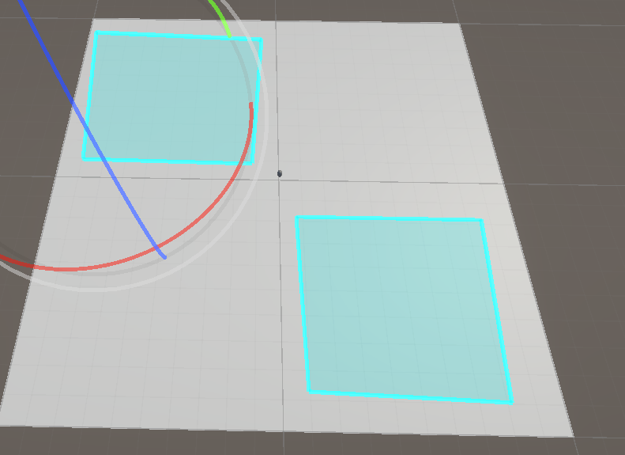

# ✨ VALENDRIA — PATROL PROTOTYPE ✨

```text
██╗   ██╗ █████╗ ██╗     ███████╗███╗   ██╗██████╗ ██████╗ ██╗ █████╗ 
██║   ██║██╔══██╗██║     ██╔════╝████╗  ██║██╔══██╗██╔══██╗██║██╔══██╗
██║   ██║███████║██║     █████╗  ██╔██╗ ██║██║  ██║██████╔╝██║███████║
╚██╗ ██╔╝██╔══██║██║     ██╔══╝  ██║╚██╗██║██║  ██║██╔══██╗██║██╔══██║
 ╚████╔╝ ██║  ██║███████╗███████╗██║ ╚████║██████╔╝██║  ██║██║██║  ██║
  ╚═══╝  ╚═╝  ╚═╝╚══════╝╚══════╝╚═╝  ╚═══╝╚═════╝ ╚═╝  ╚═╝╚═╝╚═╝  ╚═╝
```

<div align="center">

Early AI Patrol & Player Movement Prototype for the Valendria world.

 # 🔰 Status

Some tools has been made including but does not limit to:

 - 


 # 🎥 Preview (Coming Soon)

Screenshots and GIFs of NPC patrols and player movement will be added as the project evolves.

</div>

 # 🧩 Overview

This Unity prototype contains the early foundations of:

 # 🎮 Player Controller

Camera-relative movement (WASD)

Smooth yaw alignment with the player's camera

Rigidbody-based locomotion

 # 👣 Patrolling NPCs

NPCs assigned an EntityType

A manager distributes patrol routes to matching entities

Waypoints gathered automatically via tags

Structure prepared for scalable AI behaviors

 # 🧱 Project Goal

To build a clean, modular AI patrol system for the Valendria world, focusing on:

Simple setup

Expandable architecture

Designer-friendly workflow

This is an intentionally small starting point — more layers will be added as the world grows.

 # 🔮 Roadmap

Multiple patrol routes per entity type

Smarter state-based AI

Debug visualization tools

Editor window for route creation

Interaction between NPCs and the player

Environmental triggers

 # 🗂️ Project Structure (Simplified)<br>
Assets/
│<br>
├─ Scripts/<br>
│   ├─ Player/<br>
│   │   └─ MJ_PlayerController.cs<br>
│   ├─ AI/<br>
│   │   ├─ MJ_PatrolUnit.cs<br>
│   │   └─ PatrolRouteManager.cs<br>
│   └─ Core/<br>
│       └─ Entity.cs<br>
└─ Prefabs/ (future)<br>

 # 💬 Contributing

Check out fellow contributer on itch here: https://justpacey.itch.io/


<div align="center">
 # ⚔️ Welcome to Valendria.

More is coming.

</div> ```
